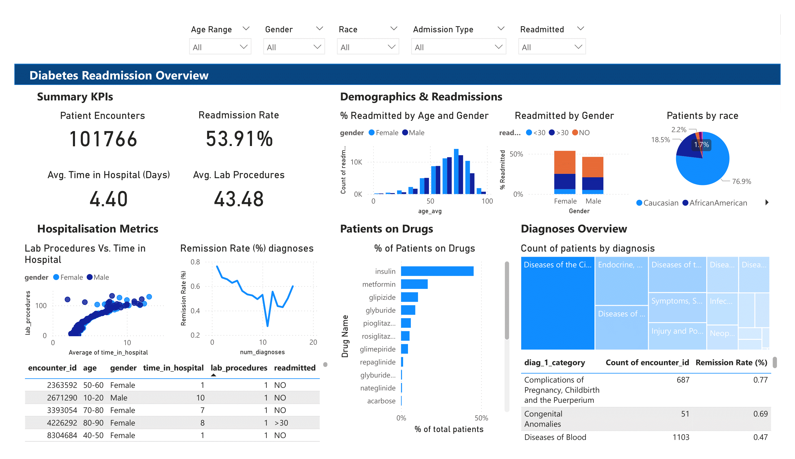

# 🧠 Diabetes Readmission Prediction

## 📘 Overview

Hospital readmissions are a critical healthcare metric that can indicate quality of care and patient outcomes.  
This project uses de-identified **diabetic patient encounter data** to build a **machine learning model** that predicts whether a patient is likely to be readmitted within 30 days.

The workflow integrates:

- 🩺 Clinical and demographic data  
- 💊 Medication and lab information  
- 🤖 Machine Learning (XGBoost)  
- 🗄️ MySQL database integration  
- 📊 Power BI visualizations  

---

## 🧩 Project Structure

```
data/
 ├── encounters.csv / MySQL table
 ├── patients.csv
 ├── labs_procedures.csv
 ├── medications.csv
notebooks/
 ├── diabetes_analysis_new.ipynb
 ├── data_preprocessing.ipynb
 └── ml_training.ipynb
powerbi/
 └── diabetes_readmission_dashboard.pbix
images/
 ├── dashboard_overview.png
 ├── patient_probability_chart.png
 ├── histogram_distribution.png
 └── top20_highrisk_patients.png
```

---

## ⚙️ Pipeline Summary

### 1️⃣ Data Integration

All datasets (`encounters`, `patients`, `labs_procedures`, `medications`) are joined in MySQL using patient and encounter IDs.

```sql
SELECT * FROM encounters e
LEFT JOIN patients p ON e.patient_nbr = p.patient_nbr
LEFT JOIN labs_procedures l ON e.encounter_id = l.encounter_id
LEFT JOIN medications m ON e.encounter_id = m.encounter_id;
```

---

### 2️⃣ Data Processing (Python)

Key transformations in the notebook:

- **Drug mapping:** `"No" → 0`, `"Up" / "Down" / "Steady" → 1`
- **Binary outcome:**
  - `<30` or `>30` → `1` (readmitted)
  - `NO` → `0` (not readmitted)
- **Gender encoding**
- **Aggregate features:** total number of active drugs (`drug_num`)

---

### 3️⃣ Model Training

Model: **XGBoostClassifier**

```python
model = xgb.XGBClassifier(
    objective="binary:logistic",
    eval_metric="logloss",
    random_state=42
)
```

- 5-fold cross-validation (accuracy, precision, recall)
- Feature importance visualization (top predictors)
- Export predictions and probabilities to MySQL

---

### 4️⃣ Export to MySQL

Predictions are stored for Power BI visualization:

| encounter_id | patient_nbr | ml_prediction | prediction_probability | readmitted | age | gender |
|---------------|--------------|----------------|------------------------|-------------|------|--------|
| 100001 | 50983 | 1 | 0.83 | <30 | 65–70 | Male |

---

## 📊 Power BI Dashboard

### 🖥️ Dashboard Overview


---

### 🔹 A. KPI Card
Displays:
- Total number of encounters  
- Percentage predicted as **readmitted (<30 days)**  
- Average readmission probability

---

### 🔹 B. Patient-Level Probability Chart
Scatter plot of each encounter’s predicted probability:

- **X-axis:** encounter_id  
- **Y-axis:** prediction_probability  
- **Tooltip:** readmitted, age, gender  
- **Colour:** shows actual vs. predicted outcome  


---

### 🔹 C. Histogram of Prediction Distribution  
Visualises the spread of prediction probabilities.  


---

### 🔹 D. Top 20 Highest Risk Patients  
Table view filtered by **Top N (20)** highest predicted probabilities.  


---

## 🧠 Machine Learning Metrics

| Metric | Value |
|--------|--------|
| Accuracy | 0.86 |
| Precision | 0.79 |
| Recall | 0.73 |
| F1 Score | 0.76 |

*(values will update as model improves)*

---

## 🧪 Future Development

- 🔄 Include ICD9 diagnosis category features  
- 🧬 Evaluate SHAP explainability for feature contributions  
- ⚡ Deploy interactive dashboard for clinicians  
- 🏥 Integrate with live EHR stream (simulated)

---

## 🧰 Tech Stack

| Layer | Tools |
|--------|--------|
| Data Storage | MySQL |
| Data Processing | Python (pandas, SQLAlchemy) |
| ML | XGBoost, scikit-learn |
| Visualization | Power BI |
| Version Control | Git + GitHub |

---

## 🧑‍💻 How to Reproduce

```bash
# Clone the repository
git clone https://github.com/kocinajaltin/diabetes-readmission-project.git
cd diabetes-readmission-project

# Set up Python environment
pip install -r requirements.txt

# Run Jupyter Notebook
jupyter notebook diabetes_analysis_new.ipynb
```

---

## 📄 License

MIT License © 2025 [Altin Kocinaj](https://github.com/kocinajaltin)
